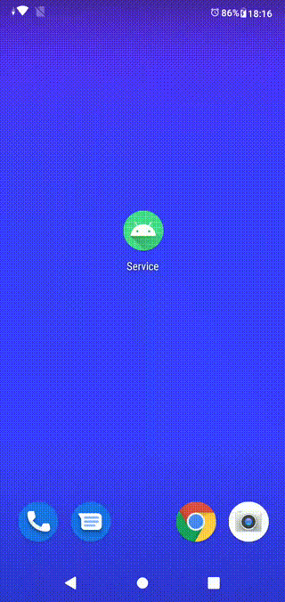

# to study Service Life Cycle

fit Android 8.0(API 26), Android 9.0(API 28) <a href="Service.V1.0.apk">Install APK</a>.

## confirmed
HTC HTL23 (Android 5.0.2)

Samsung Galaxy S7 edge (Andorid 7.0)

ASUS_X01AD(Android 9)

## article
https://www.remix.asia/blog/remix/2020/12/post_250.html
